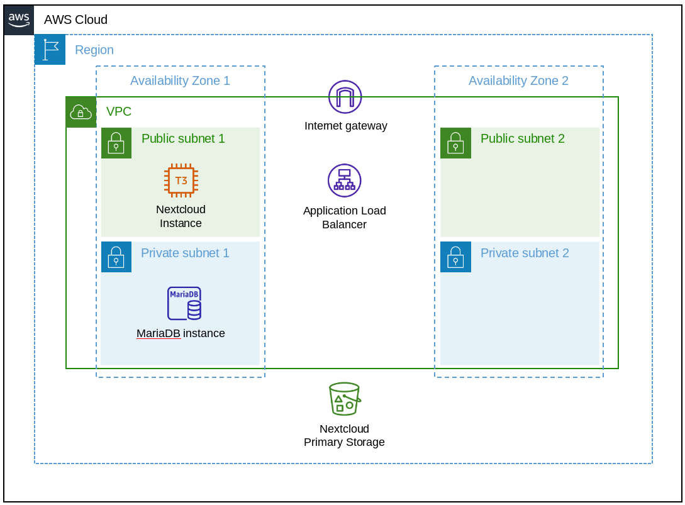

# README

> Nextcloud deployment on AWS with terraform.  

- Web-traffic and ssl connection to Nextcloud is handled by an
  `Application Load Balancer`, which needs two configured `Availability Zones`.
- Nextcloud `EC2 Instance` has direct internet access to load applications and
  updates. (Better solution includes `NAT Gateway` in `Public Subnet`.)
- Primary storage for Nextcloud is an encrypted `S3 Bucket` that is
  automatically created by terraform.
- Nextcloud also uses encryption while storing files.
- Backup needs to include Nextcloud database, encryption keys and `S3 Bucket`
  contents.



## Requirements

- terraform CLI (download: <https://www.terraform.io/downloads.html>)
- Route 53 hosted zone (available domain)

## Set variables

Create a file `terraform.tfvars` and include the following values as strings.

```terraform.tfvars
route53_zone = ""
a_record = ""
ssl_cert = ""
bucket_name = ""
admin_user = ""
admin_pass = ""
default_user = ""
default_user_pass = ""
```

- `ssl_certs` excepts an `arn` of a ssl certificate for the Nextcloud domain
  that is managed by `AWS Certificate Manager`.
- Passwords need to be at least 10 characters long and special characters must
  be escaped.

## Terraform init

```Shell script
terraform init
```

## Terraform plan

```Shell script
terraform plan
```

## Terraform apply

```Shell script
terraform apply
```

## Terraform destroy

```Shell script
terraform destroy
```

## Troubleshooting

### S3 bucket is not destroyed

Use the command AWS command line tool to empty the bucket, if Terraform
complains about a non-empty bucket during destruction.

```Shell script
aws s3 rm s3://bucket-name --recursive
```
