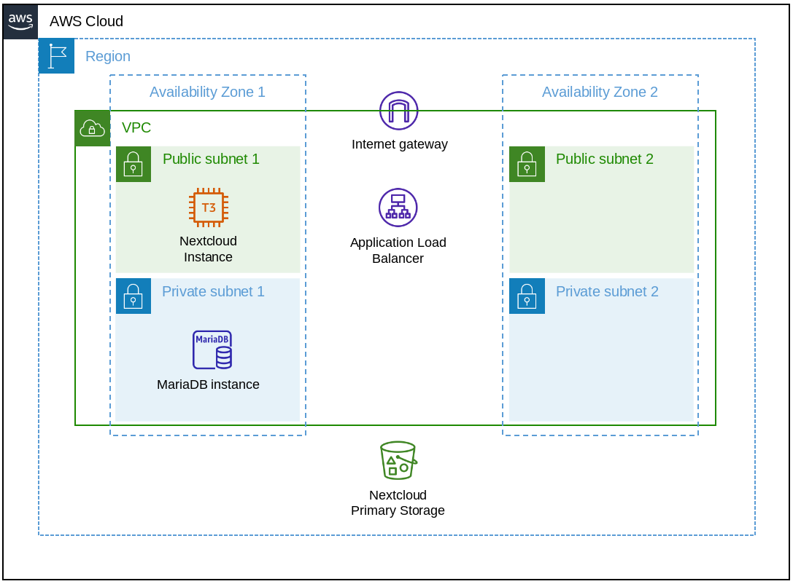

# README

## Nextcloud on AWS Managed by Terraform  

- Web-traffic and ssl connection to Nextcloud is handled by an
  `Application Load Balancer`, which needs two configured `Availability Zones`.
- Primary storage for Nextcloud is an encrypted `S3 Bucket` that is
  automatically created by Terraform.
- A separate MariaDB instance is created with `Amazon RDS` to hold all
  information on users and files.
- Backup needs to include Nextcloud config, MariaDB, `S3 Bucket` contents and
  encryption keys.



## Requirements

- terraform CLI (download: <https://www.terraform.io/downloads.html>)
- `Route 53` hosted zone (available domain)
- ssl certificate managed by `AWS Certificate Manager`

## Set variables

Create a file `terraform.tfvars` and include the following values as strings.

```terraform.tfvars
route53_zone = ""
a_record = ""
ssl_cert = ""
bucket_name = ""
admin_user = ""
admin_pass = ""
default_user = ""
default_user_pass = ""
mariadb_user = ""
mariadb_pass = ""
```

- `route53_zone` excepts an `arn` of a hosted zone by `Route 53`.
- `a_record` is the domain name, e.g. `nextcloud.example.com`.
- `ssl_certs` excepts an `arn` of a ssl certificate for the Nextcloud domain
  that is managed by `AWS Certificate Manager`.
- Passwords need to be at least 10 characters long and special characters must
  be escaped.

## Terraform init

```Shell script
terraform init
```

## Terraform plan

```Shell script
terraform plan
```

## Terraform apply

```Shell script
terraform apply
```

## Terraform destroy

```Shell script
terraform destroy
```

## Multi AZ Deployment

For a multi AZ deployment the following modifications have to be done.

- Deploy a second EC2 instance
- Change MariaDB to multi AZ

### Deploy a Second EC2 Instance

In order to use the same database user, secrets etc. the deployment for the
second EC2  instance depends on the first one for the initial deployment. In
particular, on the generated `config.php` for Nextcloud that needs to be
transferred to a new instance and slightly adjusted to avoid problems.

#### Prepare the EC2 Instance

```Shell script
#!/bin/bash
# Update ubuntu and install nextcloud snap
apt update && apt --yes upgrade
snap install nextcloud

# Create data directory in the same directory as on the other instance
mkdir /var/snap/nextcloud/common/nextcloud/data

# Place a required file in the data directory
touch /var/snap/nextcloud/common/nextcloud/data/.ocdata

# Set the rights as expected by nextcloud
chmod 770 /var/snap/nextcloud/common/nextcloud/data

# Remove install file
rm /var/snap/nextcloud/current/nextcloud/config/CAN_INSTALL
```

#### Configure Nextcloud

- Get the `config.php` from the running Nextcloud instance and remove the entry
  `'instanceid'`.
- Copy `config.php` to the default location.
  `/var/snap/nextcloud/current/nextcloud/config/`.
- Run the following script to make sure the instance works as expected.

```Shell Script
#!/bin/bash
# Stop and start all services
snap stop nextcloud
snap start nextcloud

# Rescan files
nextcloud.occ files:scan --all
```

### Change MariaDB to Multi AZ

This is pretty straight forward. Go to the resource
`aws_db_instance.db_nextcloud` and change the argument `multi_az` to `true`.

## Troubleshooting and Issues

### Internal Server Error

After first login with the admin account Nextcloud displays an **Internal
Server Error**. This is due to the creation of the account before moving the
primary storage and enabling encryption.

> **Solution** Wait and reload the page several times.

### S3 bucket is not destroyed

Use the command AWS command line tool to empty the bucket, if Terraform
complains about a non-empty bucket during destruction.

```Shell script
aws s3 rm s3://bucket-name --recursive
```

### Nextcloud Encryption Broken on Object Storage

Nextcloud has issues enforcing its encryption while using object storage as
a primary storage. To mitigate the risk of unencrypted files, the `S3 Bucket`
uses encryption. It is further advised to use other tools to encrypt sensitive
data while being stored in Nextcloud. This will break access to those files
in the web interface, but adds the desired level of security.
